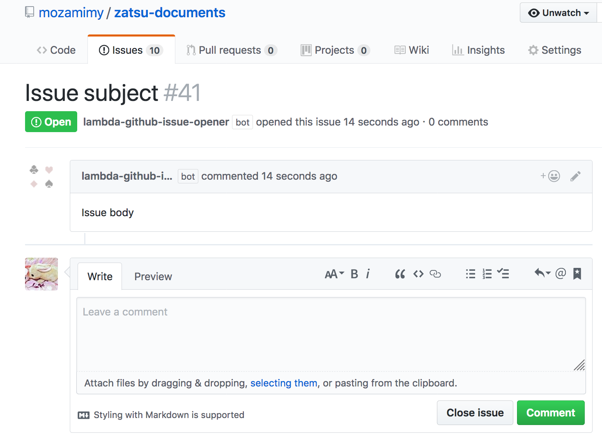

# lambda-github-issue-opener

A serverless application to open a GitHub issue by SNS notification.

An issue will be opend when a notification like following example reaches to this function.

```json
{
    "Type": "Notification",
    "MessageId": ...,
    "TopicArn": ...,
    "Subject": "Issue subject",
    "Message": "Issue body",
    "Timestamp": ...,
    "SignatureVersion": ...,
    "Signature": ...,
    "SigningCertURL": ...,
    "UnsubscribeURL": ...
}
```



## Build

```sh
go get github.com/bradleyfalzon/ghinstallation
go get github.com/google/go-github/v18/github
go get github.com/aws/aws-sdk-go/service/secretsmanager
go get github.com/aws/aws-sdk-go/aws/session
GOOS=linux make main.zip
```

## Run locally

You should install [aws-sam-cli](https://github.com/awslabs/aws-sam-cli) before follow the instructions.

```sh
cp template.json.example template.json
# And edit the template.json according to your environment
sam local invoke "GitHubIssueOpener" -t template.json
```

## Customize and deploy

**TBD**

## Contributing

Bug reports and pull requests are welcome on GitHub at https://github.com/mozamimy/lambda-github-issue-opener.

## License

This code is available as open source under the terms of the MIT License.
